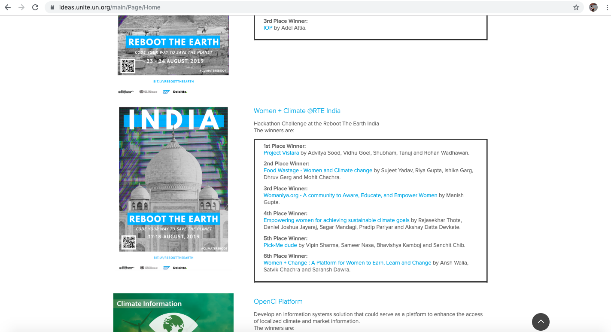

# UNTIL-ClimateReboot-hackathon-
Machine learning R codes and IOT simulation codes


Machine learinig with R files- 
                   1. time series R.r (R code)
                   2. plot1  (time series plot output)
                   3. Rplot01  (Partial PACF plot output)
                   4. Rplot . (ACF plot output)
                   5. tempreture data.xlsx (Data sets used for analysis)
                   
IOT simulation and codes
                   1.simulation_iot (Code)
                   2.simulation (simulation output video)


Secured 4th rank for idea in United Nation Technology innovation Lab (Climate Change-Reboot the Earth)
Providing inclusive solution involving women to impact climate change 
Please go through the link for documentation and the IDEA

```
https://ideas.unite.un.org/rteindia/Page/ViewIdea?ideaid=2562
```


